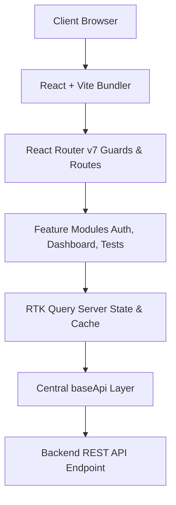

# Application Architecture

## High-Level Overview

The Preproute Test Management Portal is architected as a high performance web admin application focused on clean division of concerns, robustness, and visual excellence. The project leverages React 19, TypeScript 6, and Vite 8 for compilation, with Redux Toolkit (RTK) and RTK Query managing local and server state.

## Why Feature-First Architecture?

The project implements a **domain-driven, feature-first (or feature-based) architecture**. Unlike traditional flat architectures that organize files purely by technical type (e.g., all pages in `/pages`, all hooks in `/hooks`), a feature-first architecture groups code based on business domain.

Key reasons for this choice include:

- **High Cohesion**: Components, hooks, types, constants, validation schemas, and APIs related to a specific domain (e.g., `tests`) are grouped together.
- **Low Coupling**: Feature directories have strict boundaries, exporting only their public API via a barrel file (`index.ts`). Deep imports into the internals of another feature are prohibited.
- **Code Discovery**: Developers can instantly locate all assets pertaining to a specific page or flow without scanning the entire workspace.
- **Scalability**: Adding a new module involves creating a new self-contained feature folder, preventing file fatigue as the application grows.

## Scalability and Maintainability

Scalability and maintainability are accomplished through three fundamental principles:

1. **Dumb Components & Smart Hooks**: UI components focus solely on presentation and structure. All complex calculations, React Hook Form setup, validation schemas, and API queries are delegated to dedicated hooks (e.g., `useCreateTest` and `useQuestionBuilder`).
2. **Unified Data Layer**: A single global API service handles networking base configurations, token injections, and response parsing. Individual features inject endpoints onto this base api.
3. **Strict TypeScript Types**: Contract-first interfaces are defined for all requests and responses, ensuring compile-time safety and preventing regression bugs.

---

# High Level Architecture Diagram



---

# Folder Structure

Below is an overview of the directory structure and responsibilities:

| Folder Path               | Primary Responsibility                                                      |
| :------------------------ | :-------------------------------------------------------------------------- |
| `docs/`                   | Architectural specifications, component inventories, and coding standards.  |
| `project/src/app/`        | Global state initialization (Redux Store) and page routing definition.      |
| `project/src/components/` | Application-wide reusable UI components, layouts, and form fields.          |
| `project/src/constants/`  | Global constant values, application routes, and local storage keys.         |
| `project/src/features/`   | Domain-specific feature modules containing pages, APIs, schemas, and hooks. |
| `project/src/guards/`     | Authentication guards (`ProtectedRoute` and `PublicRoute`).                 |
| `project/src/hooks/`      | Global utility React hooks.                                                 |
| `project/src/lib/`        | Library integrations and global helpers (e.g. Tailwind class mergers).      |
| `project/src/pages/`      | Fallback and non-feature routes (e.g. `NotFound` page).                     |
| `project/src/services/`   | Centralized RTK Query base configuration and global services.               |
| `project/src/types/`      | Global TypeScript definitions and envelope interfaces.                      |
| `project/src/utils/`      | Shared helper utilities.                                                    |

---

# Feature Module Design

Each feature module located in `src/features` implements a standardized sub-folder hierarchy:

- `api/` — API mutations and queries injected onto the base API.
- `components/` — Feature-specific components.
- `constants/` — Domain text constants, defaults, and option arrays.
- `hooks/` — Domain business logic and orchestrator hooks.
- `pages/` — Top-level route components.
- `schemas/` — Zod form validation schemas.
- `types/` — Type models and API payload contracts.

### Implemented Feature Modules

#### 1. Authentication

- **Responsibility**: Securing access, processing user credentials, and managing JWT sessions.
- **Key Components**: `LoginForm` and `LoginHero`.
- **State & APIs**: Handles login mutation, updates authorization header credentials in the Redux store, and updates local storage.

#### 2. Dashboard

- **Responsibility**: Displaying the registry of created tests, handling filtering, and initiating edits/previews.
- **Key Components**: `DashboardTable`.
- **State & APIs**: Queries the tests list and filters/sorts data locally for rapid feedback.

#### 3. Create Test

- **Responsibility**: Wizard interface for test properties registration.
- **Key Components**: `CreateTestForm`.
- **State & APIs**: Resolves subjects, topics, and sub-topics dynamically; triggers test creation mutations.

#### 4. Question Builder

- **Responsibility**: Designing and sequencing test questions.
- **Key Components**: `QuestionListSidebar`, `QuestionEditorMain`, and `RichTextEditor`.
- **State & APIs**: Manages active question states, processes TipTap rich text inputs, validation, and saves questions to tests.

#### 5. Publish Test

- **Responsibility**: Triggering test status transition to publish stage.
- **Key Components**: `PublishSettingsMain`.
- **State & APIs**: Verifies question thresholds and updates test status to `live`.

#### 6. Schedule Publish

- **Responsibility**: Configuring date-time triggers and test availability limits.
- **Key Components**: `DateTimePickerField`.
- **State & APIs**: Handles form inputs for custom end-dates, formatting parameters before request packaging.

---

# State Management

| Component / Layer   | Technology Chosen | Architectural Purpose                                                                                          |
| :------------------ | :---------------- | :------------------------------------------------------------------------------------------------------------- |
| **Server State**    | RTK Query         | Manages caching, polling, automated refetching, and pagination state. Eliminates manual fetch boilerplates.    |
| **Global UI State** | Redux Toolkit     | Used sparingly for cross-cutting state, primarily authentication tokens and current user data.                 |
| **Local State**     | React `useState`  | Used for UI-only variables such as dialog visibility, collapsible sidebar state, and search queries.           |
| **Form State**      | React Hook Form   | Manages input values, dirty states, and validation triggers using uncontrolled inputs to optimize performance. |
| **Validation**      | Zod               | Strictly handles runtime validation and parses objects before API transmission.                                |

---

# Routing

The application uses React Router v7 with nested routing configurations:

- **Public Routes**: Accessible only by unauthenticated users (e.g., `/login`). Automatically redirects to the home page if a valid JWT is present.
- **Protected Routes**: Restricts access to authorized administrators. Wrapped under a `<ProtectedRoute />` layout. If unauthorized, users are redirected back to `/login`.
- **Navigation Flow**:
  ```text
  /login ──(Success)──> /dashboard ──> /tests/create ──> /tests/questions ──> /tests/publish
  ```

---

# API Communication

```text
Request:  [Component] ──> [Feature Hook] ──> [RTK Query Injection] ──> [baseApi Middleware] ──> [Backend REST API]
Response: [Backend REST API] ──> [baseApi Interceptor] ──> [transformResponse] ──> [RTK Query Cache] ──> [Component]
```

- **API Layer**: Centralized base query configured in `src/services/baseApi.ts`.
- **Authentication**: Intercepts queries to inject a Bearer JWT token read from the Redux store.
- **Error Handling**: A custom middleware interceptor catches `401` / `403` status codes to dispatch logout actions. Client-side errors are parsed by a unified helper (`getApiErrorMessage`) to display user-friendly notifications.
- **Loading States**: Handled declaratively via RTK Query status flags (`isLoading`, `isFetching`).
- **Request Flow**: API responses wrapped in envelope objects (`ApiResponse<T>`) are parsed using `transformResponse` to return unwrapped data directly to hooks.

---

# Component Design

The application implements a strict hierarchical layout:

1. **Base UI Primitives (`src/components/ui/`)**: Stateless, styling-only wrappers for raw elements (e.g., `Button`, `Input`, `Select`, `RadioGroup`).
2. **Form Wrappers (`src/components/forms/`)**: Integrates UI primitives with `FormField` templates, mapping form names directly to React Hook Form controllers. Examples include `TextField` and `SelectField`.
3. **Layout Components (`src/components/layout/`)**: Structural layouts providing grids and flex containers (`PageContainer`, `SectionCard`, `AppLayout`).
4. **AppLayout**: Includes the responsive collapsible sidebar and header, maintaining global page layout stability.

---

# Performance Optimizations

- **Memoization**: Uses `useMemo` in `DashboardPage.tsx` to handle client-side sorting and filtering. This avoids recalculating lists during unrelated component updates.
- **Uncontrolled Inputs**: React Hook Form registers inputs as uncontrolled components, preventing parent re-renders on every keystroke.
- **RTK Query Cache**: Reuses query results and invalidates cached listings using cache tags (`providesTags`, `invalidatesTags`), reducing unnecessary database operations.
- **Stable Callbacks**: Handlers are wrapped in `useCallback` to prevent breaking child component memoization.

---

# Responsive Design

Built using Tailwind CSS, implementing a fluid mobile-first breakpoint configuration:

- **Desktop (1024px+)**: Sidebar remains fixed, forms render in two-column layouts, tables render full metrics.
- **Tablet (768px - 1023px)**: Sidebar collapses into an icon-only strip. Layouts collapse into structured stacks.
- **Mobile (<767px)**: Sidebar becomes an overlay triggered by a hamburger menu. Forms collapse to single-column lists. Tables adapt to scrolling container frames.

---

# Error Handling

- **Validation Errors**: Validation is driven by Zod schema rules. Inputs display inline error labels using `FormError` slots.
- **API Errors**: Centralized in the base API interceptor. Error messages are extracted from `errors[i].msg` to provide context-specific feedback.
- **Fallback Messages**: Reusable error block UI (`ErrorState`) is displayed when data queries fail. A default message is provided when error payloads are missing.

---

# Security

- **JWT Authentication**: Secured credentials in the Redux store with authorization checks.
- **Protected APIs**: Server requests require Authorization Bearer headers.
- **Environment Variables**: API URLs are stored in environment variables, preventing hardcoded urls.
- **Input Validation**: Sanitization and validation are applied to inputs via Zod before payload compilation.

---

# Design Decisions

1. **Feature-First Architecture**: Selected over layer-first to group domain logic together.
2. **RTK Query over Axios**: Integrated RTK Query to leverage its built-in caching, tag invalidation, and declarative state hooks, replacing manual API orchestrators.
3. **TypeScript Strict Configuration**: Adopted strict type constraints to enforce type safety and catch bugs during development.
4. **Reusable Form Fields**: Abstracted inputs into fields like `TextField` and `SelectField` to centralize layouts and error indicators, ensuring a consistent UI.

---

# Known Backend Limitations

- **Question Update API Unavailable**: The backend does not expose a single question update endpoint. Modifying a test configuration requires recreating the question list or editing in bulk.
- **Delete Test API Unavailable**: No test deletion endpoint (`DELETE /tests/:id`) is provided, so the dashboard delete option is disabled.
- **Question Preview API Unavailable**: No question preview endpoint is exposed. The Question Builder sidebar is used to preview question items instead.

---

# Future Improvements

1. **Server-Side Search & Pagination**: Transition dashboard searches to remote pagination to optimize performance.
2. **Drag-and-Drop Sequencer**: Integrate a sorting library like `@dnd-kit` to allow test administrators to reorder questions visually.
3. **Draft Cache Auto-Save**: Implement local storage backup for drafts in the Question Builder.
